# Docker + CI/CD Complete Guide

> React/Vite App → Docker → GitHub Actions → Render Auto-Deploy

---

## Quick Summary

| Component          | Purpose                                          |
| ------------------ | ------------------------------------------------ |
| **Docker**         | Containerize your app for consistent deployments |
| **GitHub Actions** | Automated testing/linting on every push/PR       |
| **Render**         | Cloud hosting with auto-deploy from GitHub       |

---

## Architecture

```mermaid
flowchart LR
    A[Local Code] --> B[git push main]
    B --> C[GitHub Actions]
    C --> D{Tests Pass?}
    D -->|Yes| E[Render Auto-Deploy]
    D -->|No| F[❌ Block - Fix Code]
    E --> G[🌐 Live!]
```



---

## Step 1: Docker Configuration Files

### 1.1 Dockerfile (Multi-stage build)

```dockerfile
# Build stage
FROM node:20-alpine AS build

WORKDIR /app

# Copy package files
COPY package*.json ./

# Install dependencies
RUN npm ci

# Copy source code
COPY . .

# Build the app for production
RUN npm run build

# Production stage - using nginx to serve static files
FROM nginx:alpine AS production

# Copy built assets from build stage
COPY --from=build /app/dist /usr/share/nginx/html

# Copy nginx config for SPA routing
COPY nginx.conf /etc/nginx/conf.d/default.conf

# Expose port 80
EXPOSE 80

# Start nginx
CMD ["nginx", "-g", "daemon off;"]
```

---

### 1.2 nginx.conf (SPA routing support)

```nginx
server {
    listen 80;
    server_name localhost;
    root /usr/share/nginx/html;
    index index.html;

    # Gzip compression for better performance
    gzip on;
    gzip_vary on;
    gzip_min_length 1024;
    gzip_proxied expired no-cache no-store private auth;
    gzip_types text/plain text/css text/xml text/javascript application/x-javascript application/xml application/javascript;

    # Handle SPA routing - redirect all requests to index.html
    location / {
        try_files $uri $uri/ /index.html;
    }

    # Cache static assets
    location ~* \.(js|css|png|jpg|jpeg|gif|ico|svg|woff|woff2|ttf|eot)$ {
        expires 1y;
        add_header Cache-Control "public, immutable";
    }

    # Security headers
    add_header X-Frame-Options "SAMEORIGIN" always;
    add_header X-Content-Type-Options "nosniff" always;
    add_header X-XSS-Protection "1; mode=block" always;
}
```

---

### 1.3 .dockerignore

> [!CAUTION]
> **DO NOT include `Dockerfile` in this list!** Render uses .dockerignore during build context transfer, and ignoring the Dockerfile will cause deployment failures.

```
# Dependencies
node_modules

# Build output
dist

# Git
.git
.gitignore

# IDE
.vscode
.idea
*.swp
*.swo

# Environment files
.env
.env.*

# Logs
*.log
npm-debug.log*

# OS files
.DS_Store
Thumbs.db

# Documentation
README.md
*.md

# Docker files (avoid recursive copy)
docker-compose.yml
.dockerignore
```

---

### 1.4 docker-compose.yml (Local testing)

```yaml
version: "3.8"

services:
  order-app:
    build:
      context: .
      dockerfile: Dockerfile
    container_name: order-app
    ports:
      - "3000:80"
    restart: unless-stopped
```

---

## Step 2: CI/CD Configuration

### 2.1 GitHub Actions Workflow

Create `.github/workflows/ci.yml`:

```yaml
name: CI Pipeline

on:
  push:
    branches: [main]
  pull_request:
    branches: [main]

jobs:
  build:
    runs-on: ubuntu-latest

    steps:
      - name: Checkout code
        uses: actions/checkout@v4

      - name: Setup Node.js
        uses: actions/setup-node@v4
        with:
          node-version: "20"
          cache: "npm"

      - name: Install dependencies
        run: npm ci

      - name: Run linter
        run: npm run lint

      - name: Build application
        run: npm run build

      - name: Build Docker image
        run: docker build -t order-app .

  # Render auto-deploys when code is pushed to main
  # No manual deploy step needed - Render watches your GitHub repo
```

---

### 2.2 Render Blueprint (render.yaml)

```yaml
# Render Blueprint - Infrastructure as Code
# This file tells Render how to deploy your app

services:
  - type: web
    name: order-app
    runtime: docker
    dockerfilePath: ./Dockerfile
    dockerContext: .
    branch: main
    autoDeploy: true
    envVars: []
```

---

## Step 3: Deployment Commands

### Initial Setup (One-time)

```bash
# 1. Initialize git (if not already)
git init

# 2. Add all files including Docker config
git add .

# 3. Commit
git commit -m "Add Docker and CI/CD configuration"

# 4. Add remote (replace with your repo URL)
git remote add origin https://github.com/YOUR_USERNAME/YOUR_REPO.git

# 5. Push to main
git push -u origin main
```

### Render Setup (One-time)

1. Go to [render.com](https://render.com) → Sign up/Login
2. Click **"New +"** → **"Blueprint"**
3. Connect your GitHub account
4. Select your repository
5. Render will detect `render.yaml` and configure automatically
6. Click **"Apply"**

### Daily Workflow

```bash
# Make your changes, then:
git add .
git commit -m "your commit message"
git push origin main

# That's it! Render auto-deploys in ~2-3 minutes
```

---

## Step 4: Local Testing with Docker

```bash
# Build and run locally
docker-compose up -d

# View your app
# Open: http://localhost:3000

# View logs
docker logs order-app

# Stop container
docker-compose down
```

---

## Additional CI/CD Enhancements

### Option 1: Add Automated Tests

```yaml
# Add to .github/workflows/ci.yml in the build job
- name: Run unit tests
  run: npm test

- name: Run integration tests
  run: npm run test:integration
```

### Option 2: Add Security Scanning

```yaml
security:
  runs-on: ubuntu-latest
  steps:
    - uses: actions/checkout@v4

    - name: Run npm audit
      run: npm audit --audit-level=high

    - name: Trivy vulnerability scanner
      uses: aquasecurity/trivy-action@master
      with:
        scan-type: "fs"
        scan-ref: "."
```

### Option 3: Add Preview Deployments

Update `render.yaml`:

```yaml
services:
  - type: web
    name: order-app
    runtime: docker
    dockerfilePath: ./Dockerfile
    dockerContext: .
    branch: main
    autoDeploy: true

previewsEnabled: true # Enable preview for PRs
previewsExpireAfterDays: 7
```

### Option 4: Multi-Environment Setup

```yaml
# render.yaml with staging + production
services:
  # Production
  - type: web
    name: order-app-prod
    runtime: docker
    branch: main
    autoDeploy: true
    envVars:
      - key: NODE_ENV
        value: production

  # Staging
  - type: web
    name: order-app-staging
    runtime: docker
    branch: develop
    autoDeploy: true
    envVars:
      - key: NODE_ENV
        value: staging
```

### Option 5: Add Slack/Discord Notifications

```yaml
# Add to .github/workflows/ci.yml
notify:
  needs: build
  runs-on: ubuntu-latest
  if: always()
  steps:
    - name: Notify Slack
      uses: 8398a7/action-slack@v3
      with:
        status: ${{ job.status }}
        fields: repo,message,commit,author
      env:
        SLACK_WEBHOOK_URL: ${{ secrets.SLACK_WEBHOOK }}
```

---

## Troubleshooting Guide

### Issue: "Dockerfile not found" on Render

> [!WARNING]
> **Root Cause:** `.dockerignore` contains `Dockerfile`
>
> **Solution:** Remove `Dockerfile` from `.dockerignore`, commit, push, and redeploy

---

### Issue: SPA routes return 404

**Solution:** Ensure `nginx.conf` has:

```nginx
location / {
    try_files $uri $uri/ /index.html;
}
```

---

### Issue: Build fails on Render but works locally

**Solutions:**

1. Clear build cache: Manual Deploy → Clear build cache & deploy
2. Check if all files are committed: `git status`
3. Verify files on GitHub raw URL: `https://raw.githubusercontent.com/USER/REPO/main/Dockerfile`

---

### Issue: Windows line endings (CRLF) causing issues

**Solution:** Add `.gitattributes`:

```
* text=auto eol=lf
*.sh text eol=lf
Dockerfile text eol=lf
```

---

## Files Checklist

| File                       | Location             | Required                 |
| -------------------------- | -------------------- | ------------------------ |
| `Dockerfile`               | Project root         | ✅ Yes                   |
| `nginx.conf`               | Project root         | ✅ Yes                   |
| `.dockerignore`            | Project root         | ✅ Yes                   |
| `docker-compose.yml`       | Project root         | Optional (local testing) |
| `render.yaml`              | Project root         | ✅ Yes (for Blueprint)   |
| `.github/workflows/ci.yml` | `.github/workflows/` | ✅ Yes                   |

---

## Quick Reference Commands

| Command                     | Purpose                  |
| --------------------------- | ------------------------ |
| `docker build -t app .`     | Build Docker image       |
| `docker run -p 3000:80 app` | Run container            |
| `docker-compose up -d`      | Build & run with compose |
| `docker-compose down`       | Stop container           |
| `docker logs <container>`   | View logs                |
| `docker system prune -a`    | Clean up unused images   |
| `git push origin main`      | Deploy to production     |

---

## Summary

1. **Add Docker files** → `Dockerfile`, `nginx.conf`, `.dockerignore`
2. **Add CI/CD** → `.github/workflows/ci.yml`, `render.yaml`
3. **Push to GitHub** → `git push origin main`
4. **Connect to Render** → Blueprint → Select repo → Apply
5. **Done!** → Every push to main auto-deploys 🚀
